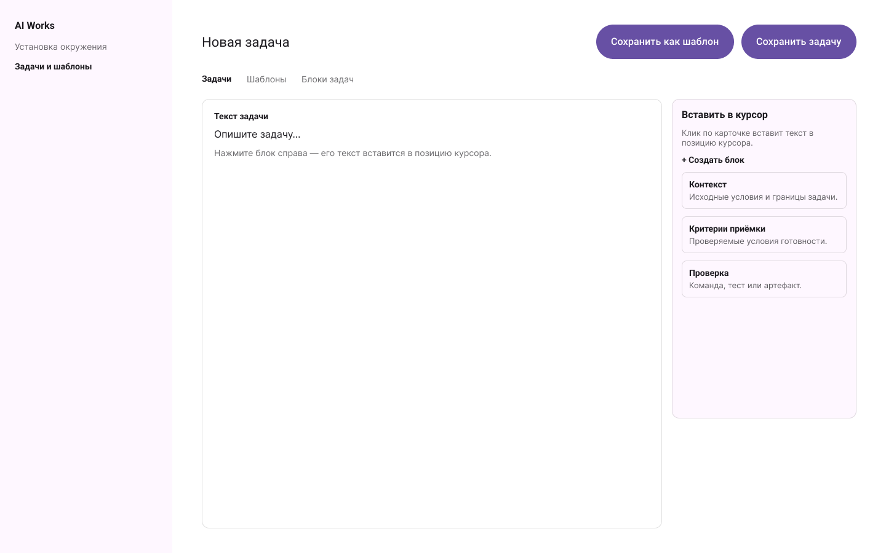
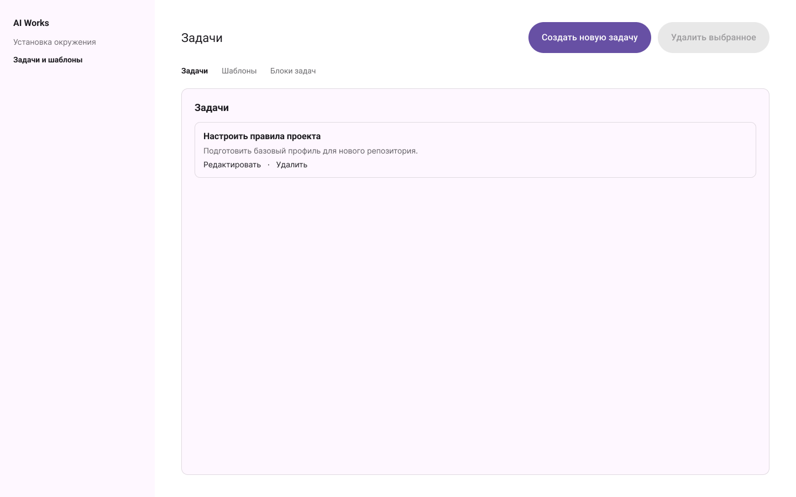

# Agent Foundry

Локальное desktop-приложение для настройки правил и skills агентов, установки
профилей в выбранный проект, а также работы с задачами, шаблонами, блоками и
рабочими пространствами. Приложение работает на компьютере пользователя и не
требует web-сервера, PostgreSQL или Docker.

## Возможности

- **Безопасная установка окружения.** Нативный выбор папки, проверка пути,
  preview/diff, режимы merge и replace с резервной копией перед заменой.
- **Единый каталог AI‑инструкций.** Rules, skills и профили редактируются в
  [`ai/`](ai/README.md), анализируются перед импортом и устанавливаются как
  производные файлы в выбранный проект.
- **Задачи и шаблоны.** У задач, шаблонов и блоков есть обязательное название,
  опциональное описание и текст; шаблон — независимая копия задачи.
- **Блоки в редакторе.** Нажатие на карточку блока вставляет его текст именно в
  позицию курсора.
- **Рабочие пространства и папки.** Сущности изолированы по пространствам,
  могут быть организованы во вложенные папки и скопированы независимо.
- **Локальные данные.** SQLite state и backup хранятся в app-data ОС; никакие
  данные задач или выбранных каталогов не отправляются в сеть.

## Интерфейс

### Создание задачи и вставка блока



### Список задач



## Быстрый запуск из репозитория

### 1. Установите зависимости один раз

- [Node.js 24.15 LTS или новее](https://nodejs.org/);
- npm, входящий в состав Node.js;
- [Rust stable](https://www.rust-lang.org/tools/install);
- системные зависимости Tauri для вашей ОС — ниже.

Проверьте установку:

```bash
node --version
npm --version
rustc --version
```

### 2. Склонируйте репозиторий

```bash
git clone https://github.com/SosnovichIvan/ai.git agent-foundry
cd agent-foundry
npm install
```

### 3. Откройте приложение

```bash
npm run tauri dev
```

Команда соберёт frontend и откроет нативное окно Agent Foundry. При повторном
запуске достаточно выполнить только `npm run tauri dev` из каталога репозитория.

## Собрать локальный пакет

```bash
npm run tauri build
```

Готовые файлы появятся в `src-tauri/target/release/bundle/`:

- macOS — `.app` и `.dmg`;
- Windows — `.msi` и/или `.exe`;
- Linux — `.deb` и/или `.AppImage`.

Подпись, notarization и публикация installer выполняются отдельным release
процессом. Для личного запуска из клона они не нужны.

## GitHub Releases

Создайте immutable tag формата `vX.Y.Z` и отправьте его в GitHub. Workflow
`Publish desktop release` проверит TypeScript, ESLint, тесты и Rust, соберёт
пакеты для macOS, Windows и Linux, создаст SHA-256 checksums и опубликует
GitHub Release. Один и тот же SemVer используется в `package.json`,
`src-tauri/tauri.conf.json` и `src-tauri/Cargo.toml`.

## Правила изменения веток

`main` и `develop` защищаются одним GitHub ruleset: прямой push, force push и
удаление ветки запрещены; merge возможен только через pull request с одним
approval и обязательным approval владельца `@SosnovichIvan`. Файл
[`.github/CODEOWNERS`](.github/CODEOWNERS) назначает владельца для всех файлов.

Для первого применения создайте fine-grained GitHub token с правом
**Administration: Read and write** только для этого repository, экспортируйте
его в терминал и выполните:

```bash
export GITHUB_TOKEN="…"
npm run github:protect-branches
unset GITHUB_TOKEN
```

Токен не сохраняется в файлах, не выводится скриптом и не попадает в Git.

## Зависимости Tauri по ОС

### macOS

Установите Command Line Tools и Rust, затем используйте команды выше:

```bash
xcode-select --install
```

### Windows

Установите Microsoft C++ Build Tools с workload **Desktop development with
C++**, Rust и актуальный Microsoft Edge WebView2 Runtime. Откройте PowerShell
или Windows Terminal в каталоге репозитория и выполните команды быстрого
запуска.

### Linux (Ubuntu/Debian)

Перед `npm install` установите системные библиотеки WebKit:

```bash
sudo apt-get update
sudo apt-get install -y libwebkit2gtk-4.1-dev libappindicator3-dev librsvg2-dev patchelf
```

Для других дистрибутивов используйте соответствующие пакеты WebKitGTK,
AppIndicator, librsvg и `patchelf`.

## Как работать с приложением

1. На вкладке «Установка окружения» выберите проект через нативный диалог.
2. Просмотрите plan/diff и примените профиль в режиме merge или replace.
3. Используйте «Задачи и шаблоны» для локальных задач, шаблонов и блоков.
4. Клик по блоку задач вставляет его текст в текущую позицию курсора редактора.

Источник переносимых rules, skills и профилей — каталог
[`ai/`](ai/README.md). Его изменяют только в этом репозитории; созданные в
целевых проектах копии вручную не редактируются.

## Данные и безопасность

- Нативный диалог выбирает целевую папку; установщик не выходит за её пределы.
- До записи всегда показывается preview; по умолчанию используется merge, а
  replace требует явного выбора и создаёт backup.
- `.env`, токены, cookies, ключи и другие secrets не читаются, не копируются и
  не логируются.
- Локальные задачи, шаблоны, блоки, папки и рабочие пространства хранятся в
  app-data ОС. Удаление или обновление репозитория не должно удалять эти данные.

## Проверки для разработки

```bash
npm run typecheck
npm run lint
npm test
cargo test --manifest-path src-tauri/Cargo.toml
npm run tauri build
```

## OpenSpec SDD

Все существенные изменения проходят OpenSpec SDD. Перед работой прочитайте
`openspec/specs/` и активный change в `openspec/changes/`. Для UI обязательны
согласованные Figma URL и `node-id`, записанные в `design-approval.md`.
